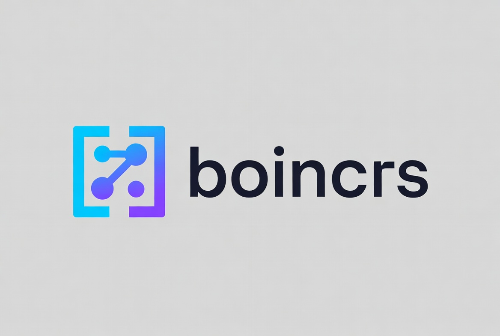

# boincrs

Terminal UI for a **local BOINC client** over the GUI RPC interface. **Beta** — PrimeGrid and Asteroids@home auto-attach via account keys are supported.

## Requirements

- [BOINC](https://boinc.berkeley.edu/download.php) client running locally with GUI RPC enabled
- [Rust](https://rustup.rs/) (stable) and `cargo`
- Reachable BOINC endpoint (default `127.0.0.1:31416`)
- GUI RPC password (often `/etc/boinc-client/gui_rpc_auth.cfg` on Linux), or `BOINCRS_PASSWORD`
- Optional: project **authenticator** keys for auto-attach

## Install from source

```bash
git clone https://www.github.com/jakenherman/boincrs.git
cd boincrs
cargo build --release
```

Binary: `./target/release/boincrs` (Linux/macOS) or `.\target\release\boincrs.exe` (Windows).

**Linux:** install Rust and BOINC, then build as above.  
**macOS / Windows:** install Rust and [BOINC](https://boinc.berkeley.edu/download.php), then the same clone/build steps.

## Compatibility

`boincrs` actively validates BOINC `7.16.x`, `7.20.x`, and `8.2.x`.
See `docs/compatibility-matrix.md` for the supported BOINC/host OS matrix,
automation coverage, manual validation steps, and known quirks.

Maintainers should use `docs/release-checklist.md` before tagging a release; it
includes the compatibility sign-off gate.

## Learn more

| Topic | Link |
| --- | --- |
| BOINC | [boinc.berkeley.edu](https://boinc.berkeley.edu/) |
| Downloads | [boinc.berkeley.edu/download.php](https://boinc.berkeley.edu/download.php) |
| Projects | [boinc.berkeley.edu/projects.php](https://boinc.berkeley.edu/projects.php) |
| Open science (background) | [Wikipedia: Open science](https://en.wikipedia.org/wiki/Open_science) |
| PrimeGrid | [primegrid.com](https://www.primegrid.com/) |
| Asteroids@home | [asteroidsathome.net/boinc](https://asteroidsathome.net/boinc/) |

## Beta UI (at a glance)

- **Panes:** Projects | Tasks | Transfers  
- **Header:** selected task — project, progress, status, elapsed/remaining, deadline, application, name; plus client run/network/gpu summary  
- **Task groups:** `READY TO REPORT` → `RUNNING` (by % done) → `WAITING / READY`  
- **Navigation:** `tab` / `shift-tab` or `left` / `right` move pane focus; `j`/`k` or `up` / `down` move selection in the focused pane  
- **Focus and state cues:** focused panes show `[focus]`, selected rows use `>>` plus reverse video, and task/transfer states include text labels like `[RUN]`, `[REPORT]`, `[ACTIVE]`, and `[ERROR]`

## Configuration

### GUI RPC password

Use the BOINC **GUI RPC** password, not project website passwords. Set `BOINCRS_PASSWORD` or point `BOINCRS_PASSWORD_FILE` at your `gui_rpc_auth.cfg`.

### Project authenticators (attach)

Use each project’s **account key** from its BOINC account pages — not the web login password.

- **PrimeGrid:** [Project prefs](https://www.primegrid.com/prefs.php?subset=project)  
- **Asteroids@home:** [Account / home](https://asteroidsathome.net/boinc/home.php)  

### Environment

```bash
cp .env.example .env
# edit .env, then:
set -a && source .env && set +a   # Linux/macOS
```

With `BOINCRS_PRIMEGRID_ACCOUNT_KEY` / `BOINCRS_ASTEROIDS_ACCOUNT_KEY` set, startup runs `project_attach` then `project_update` for those projects.

### Project templates and preset profiles

`boincrs` ships a curated registry of well-known BOINC projects so you can attach them by **slug** rather than memorizing each master URL. Known slugs: `asteroids`, `einstein`, `gpugrid`, `lhc`, `milkyway`, `primegrid`, `rosetta`, `seti`, `worldcommunitygrid`, `yoyo`.

Attach by template via `BOINCRS_ATTACH_TEMPLATES` (semicolon-delimited `slug|account_key`):

```bash
export BOINCRS_ATTACH_TEMPLATES='rosetta|ACCOUNT_KEY_A;einstein|ACCOUNT_KEY_B'
```

For repeatable setups, use a **preset profile** file (`key = value` format) and point `BOINCRS_PROFILE_FILE` at it:

```ini
# boincrs.profile
name = desktop
run_mode = auto
network_mode = auto
gpu_mode = never
attach = primegrid|ACCOUNT_KEY_A
attach = rosetta|ACCOUNT_KEY_B
```

Invalid slugs, URLs, or mode values are rejected with line-level validation errors so you see exactly what to fix. See [`docs/architecture/project-templates-and-profiles.md`](docs/architecture/project-templates-and-profiles.md) for the full schema.

### Run

```bash
cargo run
# or: ./target/release/boincrs
```

### Keyboard

| Keys | Action |
| --- | --- |
| `tab` / `shift-tab` | Move focus forward / backward across Projects, Tasks, Transfers |
| `left` / `right` | Move pane focus backward / forward |
| `j` `k` / arrows | Move selection (any pane) |
| `r` | Refresh |
| `q` | Quit |
| `y` / `n` / `Esc` | Confirm / cancel destructive actions |
| `u/s/c/w/a/x/d` | Project actions |
| `t/g/b` | Task actions |
| `f` | Retry transfer |
| `1`–`9` | Run / network / GPU modes |

### Accessibility and theming

- The UI is designed to stay readable in dark, light, and high-contrast terminal themes by using explicit text labels in addition to semantic colors.
- Focus is visible without color alone: the active pane title shows `[focus]`, and the selected row is marked with `>>` and reverse video.
- Task and transfer state is not color-only: labels such as `[RUN]`, `[WAIT]`, `[REPORT]`, `[ACTIVE]`, `[IDLE]`, `[ERROR]`, `[suspended]`, and `[no-new-work]` remain visible in monochrome terminals.
- `NO_COLOR=1 cargo run` disables color accents while keeping the text labels, reverse-video selection, and keyboard cues.
- Keyboard-only workflow: move pane focus with `tab` / `shift-tab` or `left` / `right`, move within a pane with `j` / `k` or `up` / `down`, then use action keys or `y` / `n` / `Esc` for confirmations.

Known constraints:

- Terminal applications cannot reliably detect whether your emulator is currently using a light, dark, or custom high-contrast theme, so boincrs favors terminal default foreground/background colors plus explicit labels over theme-specific palettes.
- Reverse video, bold, and underline rendering can vary slightly between terminal emulators and fonts, especially over SSH or in multiplexers like tmux.
- boincrs currently does not expose a custom per-widget palette; accessibility/theming is driven by your terminal theme and the optional `NO_COLOR` convention.

## Testing & verification

```bash
cargo test
cargo test --test compatibility_matrix_tests
```

**Against a live local BOINC daemon** (ignored tests — needs GUI RPC password):

```bash
BOINCRS_PASSWORD_FILE=/etc/boinc-client/gui_rpc_auth.cfg \
  cargo test --test live_local_boinc -- --ignored --nocapture
```

**PrimeGrid + Asteroids attach** (needs account keys):

```bash
BOINCRS_PASSWORD_FILE=/etc/boinc-client/gui_rpc_auth.cfg \
BOINCRS_PRIMEGRID_ACCOUNT_KEY='…' \
BOINCRS_ASTEROIDS_ACCOUNT_KEY='…' \
  cargo test --test live_beta_projects -- --ignored --nocapture
```

**Manual smoke:** projects and tasks populate; task groups and sorting look right; focused pane shows `[focus]`; selected rows show `>>`; status labels remain readable with and without color; keyboard-only navigation works via `tab` / `shift-tab`, arrows, `j` / `k`, and `Esc`; safe actions work; destructive actions prompt `y/n`. See `docs/architecture/smoke-checklist.md`.

## Roadmap

`ROADMAP.md`

## Changelog

`CHANGELOG.md`

## Contributing

`CONTRIBUTING.md`

## Support

`SUPPORT.md`

## License

MIT — see `LICENSE`.

## Security

Do not commit real `.env` values. Treat GUI RPC password and project authenticators as secrets.

## More docs

- `docs/architecture/app-controller.md`
- `docs/architecture/smoke-checklist.md`
- `docs/architecture/beta-primegrid-asteroids.md`
- `docs/architecture/project-templates-and-profiles.md`
- `docs/compatibility-matrix.md`
- `docs/release-checklist.md`
- `docs/decisions/0001-error-handling.md`
