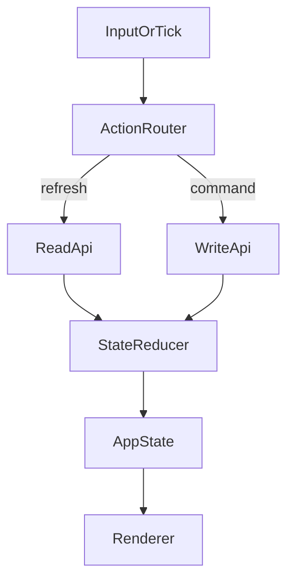
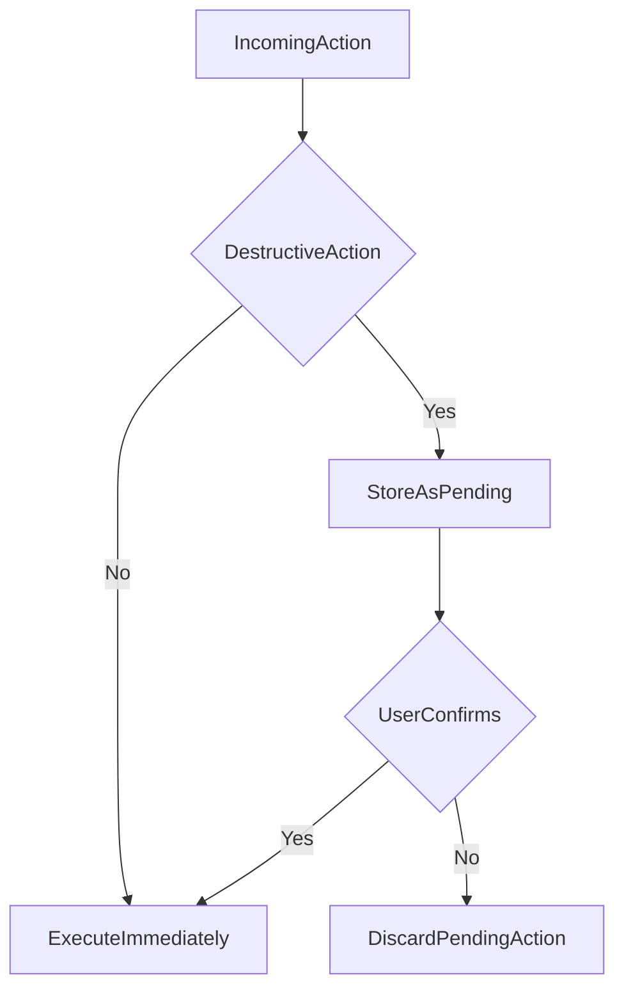

# App controller

The `AppController` drives `boincrs` as a deterministic event loop:

- gathers input events
- updates in-memory state
- dispatches BOINC RPC reads / writes
- triggers terminal redraws

## High-level flow

## Confirmation flow for destructive actions

## Reusability choices

- Read and write RPC logic is split into `BoincReadApi` and `BoincWriteApi`.
- Transport is abstracted by `BoincTransport`, so tests can inject a fake
  transport.
- UI rendering is isolated under `src/ui/**` and only consumes `AppState`.

See the [error-handling decision record](../decisions/0001-error-handling.md)
for how failures flow through the same pipeline without panicking.
